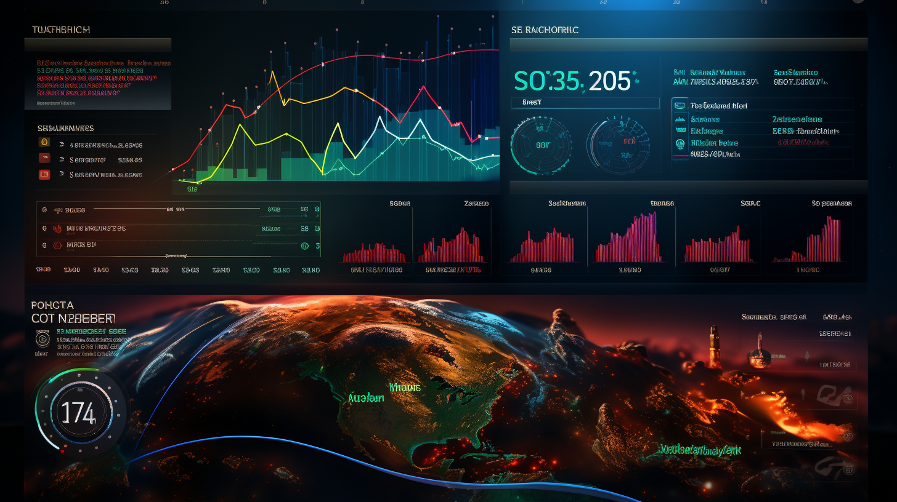

# Drug-Demand-Forecasting-XXXX
### A project that uses time series analysis and machine learning to predict the demand for various drugs. This could help XXXX better manage its inventory and reduce waste.

# 🌟 Drug Demand Forecasting for Healthcare - A McKesson Case Study 🌟

Welcome to our project! We've embarked on a journey to solve a real-world problem faced by healthcare companies like McKesson: predicting the demand for various drugs to better manage inventory and reduce waste. 💊🏥

## 🚀 Getting Started 🚀

This project uses Python and several data science libraries. To get started, you'll need to install the required libraries. You can do this by running:

```bash
pip install -r requirements.txt
```

## 📚 How It Works 📚

Our project consists of several steps:

1. **Data Collection and Preprocessing:** We generate synthetic data for our project, creating a dataset with sales data for three drugs for each day of the year 2022. 📈📅

2. **Exploratory Data Analysis:** We visualize the sales data for the three drugs over time, helping us understand the trends and patterns in our data. 📊🔎

3. **Feature Engineering:** We create new features from the date, including the day of the week, the month, the day of the month, and the day of the year. These features can help our model capture weekly, monthly, and yearly patterns in the sales data. 📆🔧

4. **Model Selection and Training:** We choose the Random Forest model for our forecasting task. We train a separate model for each drug. 🌲🤖

5. **Model Evaluation:** We evaluate our models using the Mean Absolute Percentage Error (MAPE), which gives us an idea of the average error of our models as a percentage of the actual values. 🎯📏

6. **Model Deployment:** We create a function that takes in the features of a new data point and returns the predicted sales for each drug. This function can be used to make predictions on new data. 🚀🔮

## 🎉 Conclusion 🎉

We hope you find this project interesting and educational. It demonstrates how data science can be used to solve real-world problems in the healthcare industry. However, our approach has some limitations and there's always room for improvement. So, feel free to fork this project and make your own contributions! 🎉🏁

## 📖 License 📖

This project is licensed under the terms of the MIT license. For more details, see the [LICENSE](LICENSE) file.